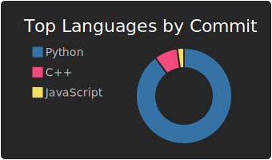
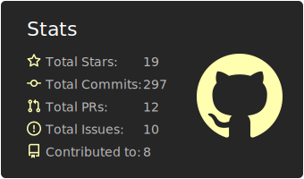
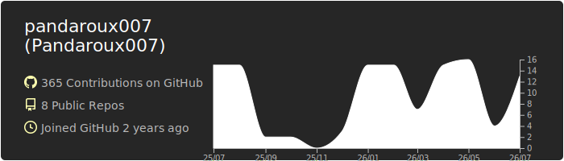

> 🇫🇷 Just a young French amateur developer.

📌 I'm passionate about many other areas so not (quite) dedicated to programming, but I learn a little more every day. I particularly enjoy working in a team. I speak fluent French, and also English, even though I don't speak it fluently; I can manage without a translator.

🫂 I really like contributing to communities and their projects. I especially support lightweight and useful open-source apps, without AI, ads, tracking, or unnecessary and polluting features.

I'm mainly active on Discord (`@_pandaroux007`), the Arduino forum (my [profile](https://forum.arduino.cc/u/pandaroux007/) is private, and I'm only in the French-speaking section), and on [GitHub](https://github.com/pandaroux007), of course. Occasionally [CodinGame](https://www.codingame.com/profile/4c2518e96a4f220e9a055772616c37a99550346) and [the Mozilla Firefox extensions site](https://addons.mozilla.org/fr/firefox/user/18709290/), but I'm often too busy to be active there; I only maintain my browser extension projects. *My [YouTube](https://www.youtube.com/@pandaroux007) account is currently inactive and will remain so until further notice.*
___

   
  

___
I have a fairly good grasp of Arduino (PlatformIO, C/C++), as well as python3. 
I know the basics of `git`, HTML5, CSS3, JavaScript, Linux shell (I use Mint), ESP8266/ESP32, and RPi.

**I would like to explore or learn more about the following areas** (may no longer be up to date):
- **Modern C++** (I have, until now, only encountered "C-style" C++ with embedded systems. I do not master the compilation process, libraries etc. outside of the Arduino framework, nor the development practices in "modern" C++).

- **Git** (I use it for GitHub but I'm not comfortable with its primary function, versioning (conflicts, undoing, etc.). Yet it's an essential skill in a team).

- **Regular expressions** (a classic in programming, which I can recognize but neither understand nor construct by hand at the moment)

- **SQL** (I have some basic knowledge of SQLite but nothing very advanced)

- The **Linux system** (mainly more advanced uses of shell, bach, systemd, and server management via SSH)

- Containerization systems, especially **Docker**

- **Web technologies** 
  *The first good way to do good with programming is that almost everyone goes online, especially to AI and social networks, which we need to understand in order to use them without letting them control our lives.*
  - Managing a server and a back-end (using various technical stacks):
    - Django
    - Apache, Nginx
    - The basics of PHP
    - Routes, addressing, and other network configurations.
  - Creation of complex front-ends:
    - JavaScript/Typescript (because even though I hate the syntax of this language and it is not compiled, it is widely used)
    - *Once JS/TS is more or less mastered, I imagine the next step will be Alpine.js, React, Vue.js, Angular, Next.js or who knows what else...*

- **Mobile development** 
  *Everyone has a phone in their pocket, and along with the web, it's the second best way to reach people.*
  - Kotlin (or Java, or even C++, depending on what is most suitable) for Android (Android Studio)
  - React Native (the other option, it seems to me, if I want to use it with JavaScript/Typescript, and I need to look into Expo)
  - I don't want to learn Objective-C and Swift because I hate the Apple environment 🤮

- **The field of graphics (games, 3D rendering...)** 
  *An interesting point would be to develop a mini dynamic 3D system (a game is too ambitious without an engine) to understand the concept of shaders, triangle rendering, and all the steps through which game information passes to be displayed*
  - **Unreal Engine** (I like Unity less)
  - **OpenCV** (possibly on ESP32 or RPi)
  - **Blender** (and other more general software, such as GIMP or Inkscape)
___
- (*Uncertainty*) Rust (I don't know if it's better than something else for the areas that are really useful, so it's only on the "wish list")
- (*Uncertainty*) AI (understanding how an LLM, or any other form of artificial intelligence requiring training, really works. This could involve developing a mini-model; we'll see if it's too time-consuming or pointless, although it would improve my mathematical knowledge)
